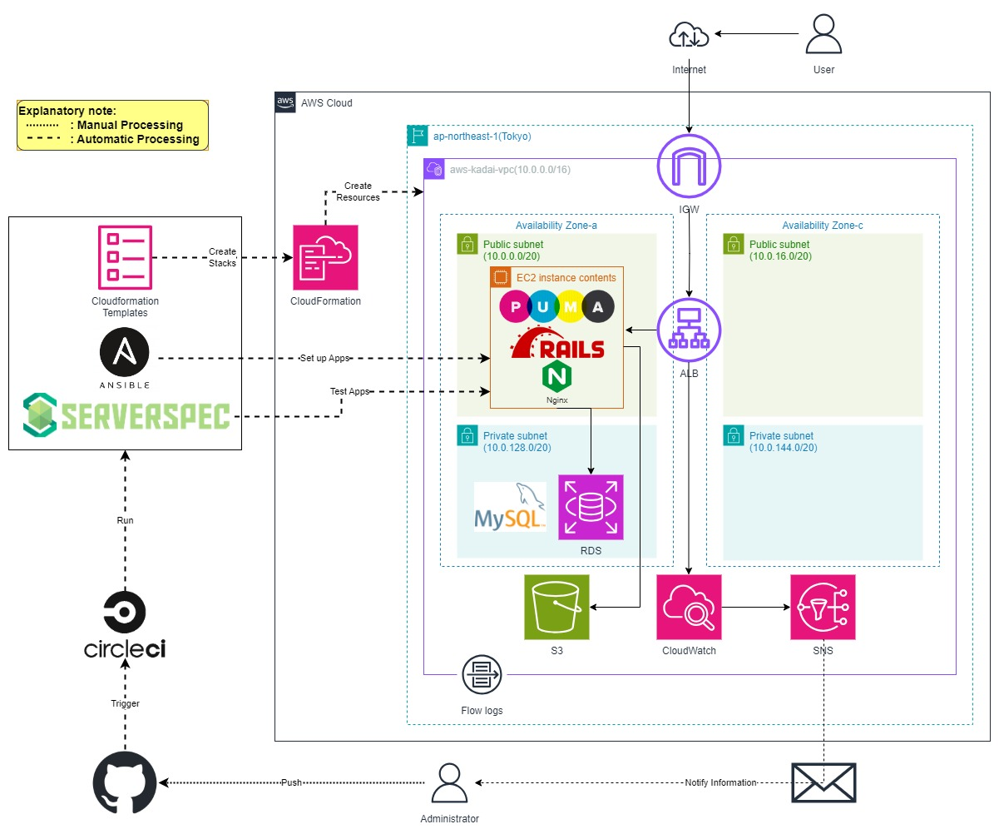
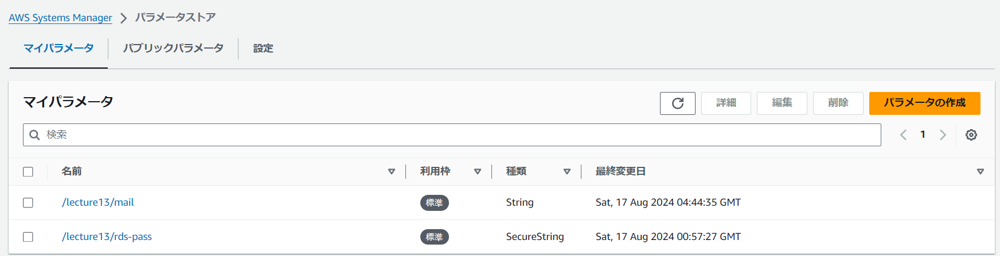

# AWSフルコース講座 第13回課題 成果物

  

## 実施内容
CircleCIでCloudformation・Ansible・Serverspecを実行する

CircleCI の[サンプル](https://github.com/MasatoshiMizumoto/raisetech_documents/tree/main/aws/samples/circleci)に ServerSpec や Ansible の処理を追加し、一連の処理を成功させる。  
- 構築した環境（詳細は[課題13](https://github.com/SUZUKI-Takayuki-0404/RaiseTechAWS/blob/main/lecture13.md)を参照）  
  - [課題5](https://github.com/SUZUKI-Takayuki-0404/RaiseTechAWS/blob/main/lecture05.md)で実装した[サンプルアプリ](https://github.com/yuta-ushijima/raisetech-live8-sample-app.git)をAnsibleで実装自動化  
  - [課題10](https://github.com/SUZUKI-Takayuki-0404/RaiseTechAWS/blob/main/lecture10.md)でCloudformationにより構築自動化した環境にVPC Flow logも追加  
  - [課題11](https://github.com/SUZUKI-Takayuki-0404/RaiseTechAWS/blob/main/lecture11.md)で自動テストコードを作成したServerspecを追加  
  - [課題12](https://github.com/SUZUKI-Takayuki-0404/RaiseTechAWS/blob/main/lecture12.md)でCfn-lintによりセキュリティ指摘されたRDSのパスワードをSystems Managerのパラメータストアに追加  
- 構成図  
    

> [!NOTE]  
> 予め、以下を準備しておくこと（詳細は[課題13](https://github.com/SUZUKI-Takayuki-0404/RaiseTechAWS/blob/main/lecture13.md)を参照）  
> - CircleCI用のIAMユーザー・許可ポリシー・アクセスキー  
> - EC2 SSH接続用のpemキー  
> - Systems Manager  
>   - SNSのメール通知機能で使用するメールアドレス\(String\)  
>   - RDSで使用するパスワード\(SecureString\)  
>        
